# Архитектура системы

## Обзор

Система построена на принципах **Clean Architecture** с четким разделением ответственности между слоями. Архитектура обеспечивает независимость бизнес-логики от деталей реализации, что делает систему легко тестируемой, расширяемой и поддерживаемой.

## Архитектурные слои

Система организована в четыре основных слоя:

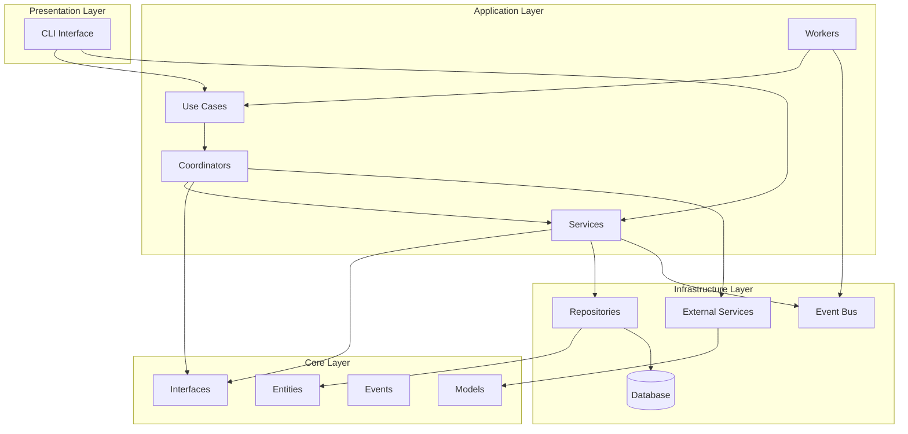

### Core Layer (Ядро)

**Назначение:** Содержит бизнес-логику и доменные сущности, не зависящие от внешних библиотек и фреймворков.

**Компоненты:**
- **Entities** — доменные сущности (User, PatientProfile, Appointment, AppointmentSearchRequest, TimePreferences)
- **Interfaces** — контракты для репозиториев и сервисов
- **Events** — доменные события для асинхронной коммуникации
- **Models** — модели данных для внешних API
- **Enums** — перечисления для статусов и типов

**Принципы:**
- Не зависит от других слоев
- Содержит только бизнес-логику
- Определяет интерфейсы, реализуемые в Infrastructure

### Application Layer (Приложение)

**Назначение:** Содержит бизнес-логику приложения, use cases и координацию между сервисами.

**Компоненты:**
- **Use Cases** — конкретные сценарии использования (CheckAppointmentSearchRequestsUseCase)
- **Services** — сервисы приложения (AppointmentService, PatientService, TimePreferencesService)
- **Coordinators** — координаторы для сложных операций (AppointmentCoordinator)
- **Workers** — фоновые сервисы (AppointmentSchedulerWorker)
- **DTOs** — объекты передачи данных между слоями

**Принципы:**
- Зависит только от Core
- Содержит бизнес-правила и валидацию
- Использует интерфейсы из Core, не зная об их реализации

### Infrastructure Layer (Инфраструктура)

**Назначение:** Реализует технические детали: доступ к данным, внешние API, события.

**Компоненты:**
- **Repositories** — реализация паттерна Repository для работы с БД
- **Persistence** — конфигурация Entity Framework, миграции
- **Services** — реализация внешних сервисов (ExternalAppointmentService, ExternalPatientService)
- **ApiClient** — HTTP клиент для работы с внешним API
- **Events** — реализация Event Bus (InMemoryEventBus)
- **Security** — хеширование паролей и другие функции безопасности

**Принципы:**
- Реализует интерфейсы из Core
- Содержит технические детали реализации
- Может быть заменен без изменения бизнес-логики

### Presentation Layer (Представление)

**Назначение:** Пользовательский интерфейс и точка входа в приложение.

**Компоненты:**
- **CLI** — консольный интерфейс с меню и командами

**Принципы:**
- Зависит от Application и Infrastructure
- Отвечает только за представление данных
- Не содержит бизнес-логики

## Основные паттерны

### 1. Repository Pattern

Инкапсулирует логику доступа к данным, предоставляя более объектно-ориентированный интерфейс.

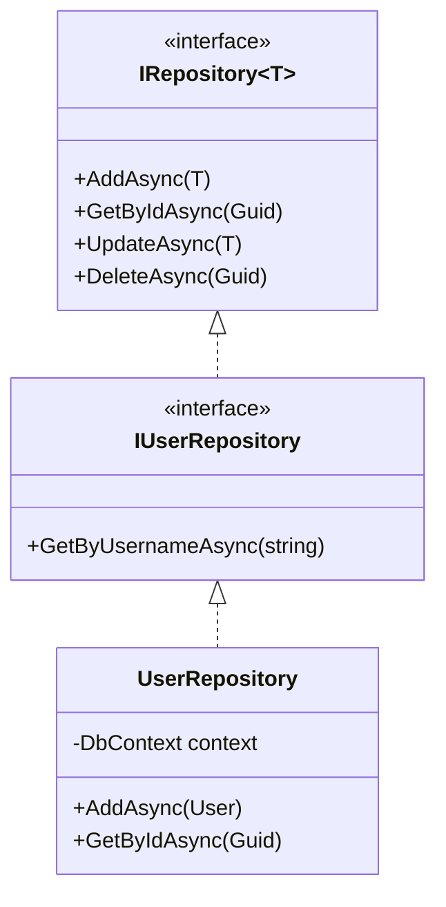

### 2. Service Layer Pattern

Сервисы инкапсулируют бизнес-логику и координируют работу между репозиториями.

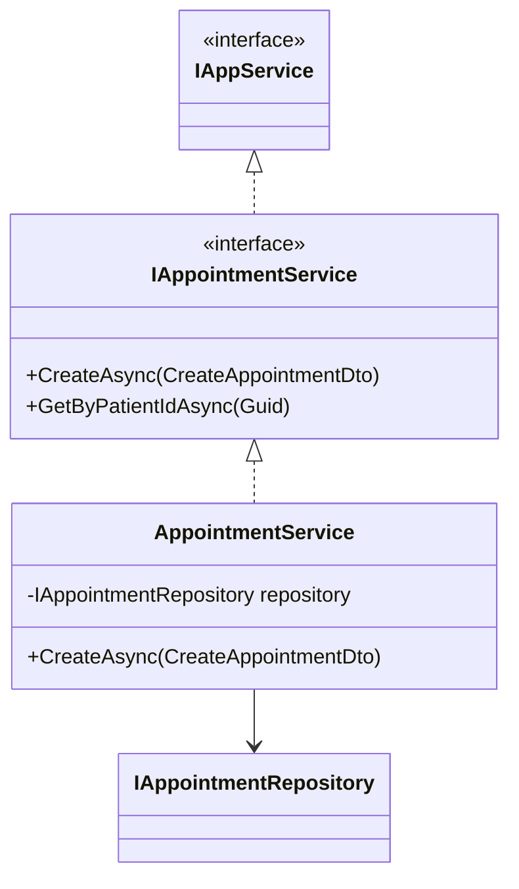

### 3. Coordinator Pattern

Координаторы управляют сложными бизнес-процессами, объединяя несколько сервисов.

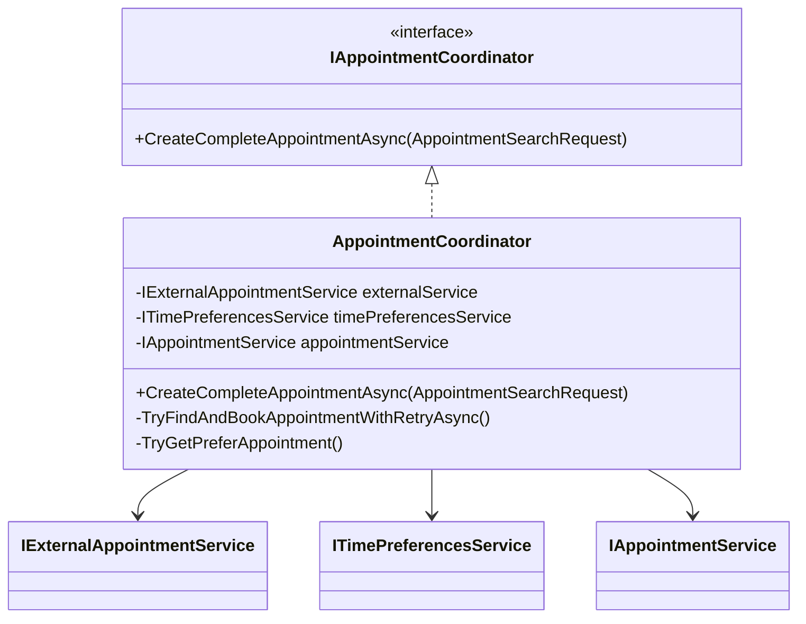

### 4. Event Bus Pattern (Pub/Sub)

Асинхронная коммуникация между компонентами через события.

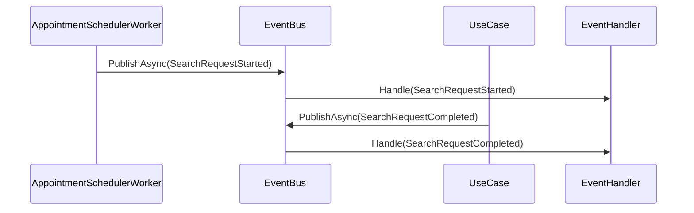

### 5. Use Case Pattern

Каждый use case представляет отдельный бизнес-сценарий.

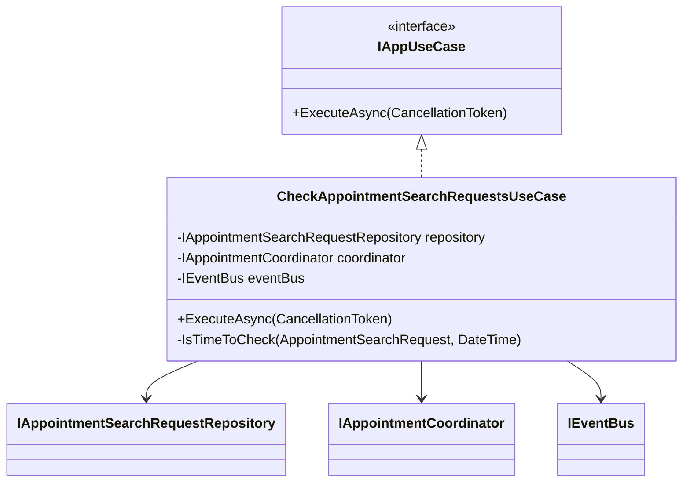

## Основной workflow

### Процесс автоматического поиска и бронирования

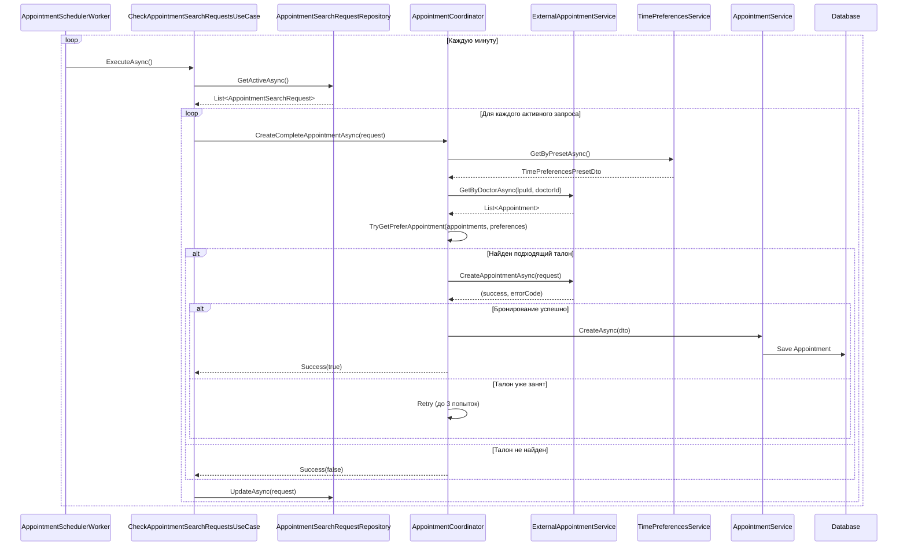

### Жизненный цикл запроса на поиск

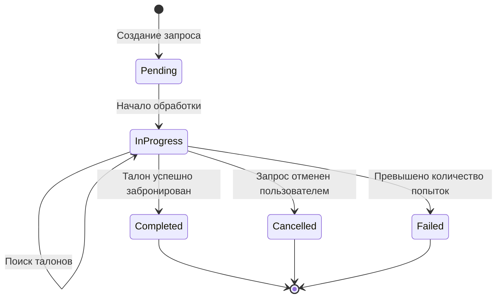

## Структура данных

### Основные сущности

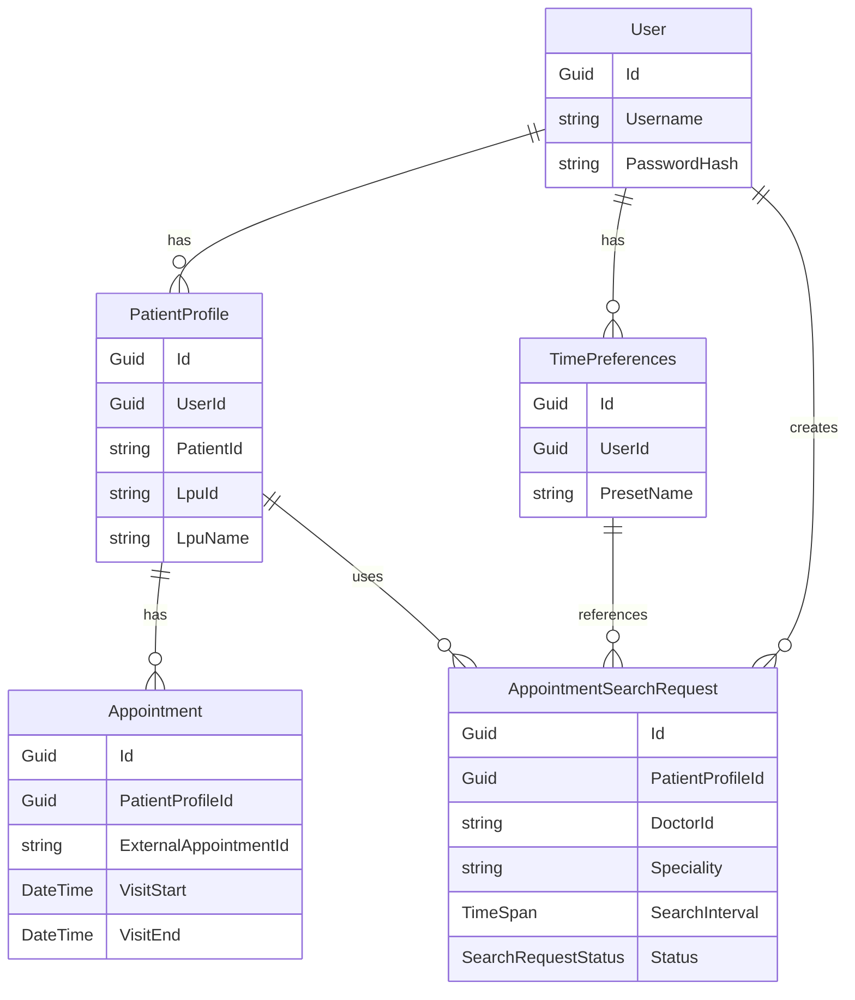

## Система событий

События используются для асинхронной коммуникации и обновления UI в реальном времени.

### Типы событий

- **SearchRequestStarted** — начало обработки запроса на поиск
- **SearchRequestCompleted** — завершение обработки запроса
- **NextSearchScheduled** — запланирована следующая проверка
- **SearchServiceStatusChanged** — изменение статуса сервиса поиска

### Поток событий

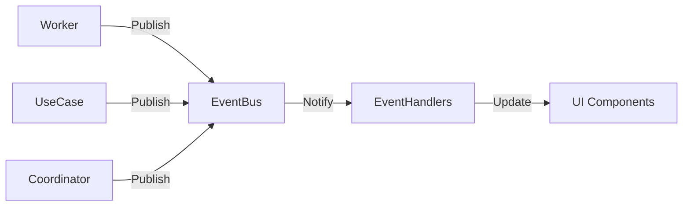

## Dependency Injection

Система использует встроенный DI контейнер .NET для управления зависимостями.

### Регистрация сервисов

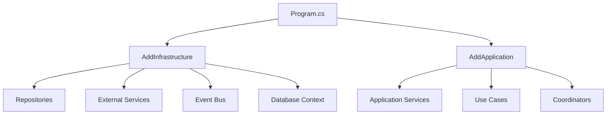

**Принципы регистрации:**
- Репозитории и сервисы — `Scoped`
- Event Bus — `Singleton`
- Workers — `HostedService`

## Обработка ошибок

Система использует паттерн Result для обработки ошибок без исключений.

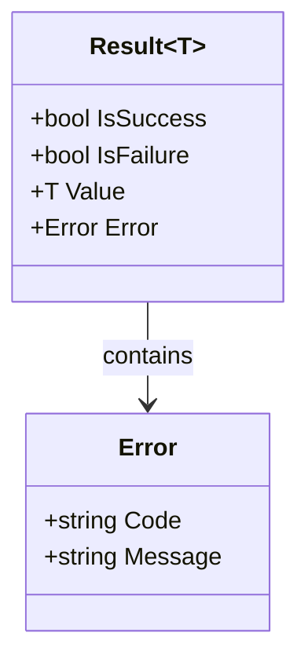

**Типы ошибок:**
- `NotFound` — ресурс не найден
- `Conflict` — конфликт при создании/обновлении
- `Failure` — общая ошибка выполнения
- `Validation` — ошибка валидации

## Тестирование

Архитектура поддерживает легкое тестирование благодаря:

1. **Инверсии зависимостей** — все зависимости через интерфейсы
2. **Разделению слоев** — каждый слой тестируется независимо
3. **Использованию моков** — внешние сервисы легко мокируются

### Структура тестов

```
tests/
├── UnitTests/
│   ├── Application.Tests/
│   └── Infrastructure.Tests/
```

## Масштабируемость

Архитектура позволяет легко:

- **Добавлять новые use cases** — просто реализовать `IAppUseCase`
- **Добавлять новые сервисы** — реализовать интерфейс из Core
- **Менять реализацию** — заменить Infrastructure без изменения Application
- **Добавлять новые UI** — создать новый Presentation слой (например, Web API или Telegram Bot)

## Заключение

Архитектура системы обеспечивает:

✅ **Чистоту кода** — четкое разделение ответственности  
✅ **Тестируемость** — легкость написания unit-тестов  
✅ **Расширяемость** — простое добавление новых функций  
✅ **Поддерживаемость** — понятная структура и паттерны  
✅ **Независимость** — бизнес-логика не зависит от деталей реализации
